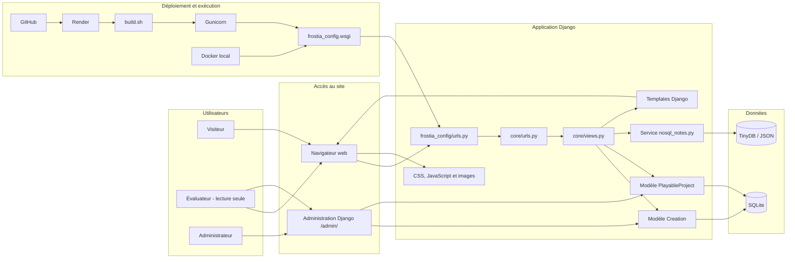

# Architecture du projet — Frostia Games

## Objectif du document

Ce document présente l'architecture du projet **Frostia Games**.

L'objectif est d'expliquer comment le projet est organisé, quel est le rôle des principaux dossiers et fichiers, et comment les différentes parties du site fonctionnent ensemble.

Le projet est une application web développée avec **Django**.

Il sert de portfolio pour présenter des projets de jeux vidéo actuels ou futurs, avec :

- une interface publique simple ;
- une base SQLite ;
- une expérimentation NoSQL légère avec TinyDB ;
- une administration Django ;
- un accès d’évaluation en lecture seule ;
- une documentation technique ;
- un déploiement en ligne sur Render.

Cette architecture correspond à une V1 stable, documentée, déployée et volontairement limitée.

---

# 1. Vue d'ensemble

Frostia Games est organisé autour d'une architecture Django simple.

Le projet contient :

- une configuration Django principale ;
- une application dédiée aux pages principales ;
- une application dédiée aux créations ;
- une application dédiée aux futurs projets jouables ;
- des services internes Python ;
- des scripts de démonstration ;
- des templates HTML ;
- des fichiers statiques CSS, JavaScript et images ;
- une base SQLite pour les données principales ;
- une base TinyDB pour des notes de progression ;
- une administration Django ;
- un compte d’évaluation en lecture seule ;
- des fichiers Docker ;
- des fichiers de déploiement Render ;
- une documentation principale dans `doc/` ;
- une documentation complémentaire dans `docs/`.

L'objectif de la V1 n'est pas de créer une plateforme complète, mais de produire une base stable, fonctionnelle, documentée et déployée.

---

# 2. Structure générale du projet

Structure simplifiée :

```text
frostia-games/
├── frostia_config/
│   ├── settings.py
│   ├── urls.py
│   ├── wsgi.py
│   └── asgi.py
│
├── core/
│   ├── services/
│   │   └── nosql_notes.py
│   ├── management/
│   │   └── commands/
│   │       └── setup_render_data.py
│   ├── urls.py
│   ├── views.py
│   ├── apps.py
│   └── tests.py
│
├── creations/
│   ├── migrations/
│   ├── admin.py
│   ├── apps.py
│   ├── models.py
│   └── tests.py
│
├── playable/
│   ├── migrations/
│   ├── admin.py
│   ├── apps.py
│   ├── models.py
│   └── tests.py
│
├── scripts/
│   ├── __init__.py
│   └── demo_tinydb_notes.py
│
├── data/
│   └── nosql/
│       └── project_notes_db.json
│
├── templates/
│   ├── partials/
│   │   └── base.html
│   └── pages/
│       ├── home.html
│       ├── creation.html
│       └── projet_jouable.html
│
├── static/
│   ├── css/
│   │   └── main.css
│   ├── js/
│   │   └── menu.js
│   └── images/
│
├── doc/
├── docs/
├── .dockerignore
├── .env.example
├── .gitignore
├── build.sh
├── CHOIX_TECHNIQUES.md
├── docker-compose.yml
├── Dockerfile
├── manage.py
├── PREUVES-FONCTIONNEMENT.md
├── pyproject.toml
├── README.md
└── requirements.txt
```

## 2.1. Schéma Mermaid de l’architecture

Le schéma suivant complète l’arborescence précédente. Il présente les principaux utilisateurs, le parcours d’une requête, les composants Django, les bases de données et le déploiement du projet.



Lecture du schéma :

- le visiteur utilise les pages publiques depuis son navigateur ;
- l’administrateur et l’évaluateur en lecture seule utilisent l’administration Django avec des droits différents ;
- les routes dirigent les requêtes vers les vues de l’application `core` ;
- les vues interrogent les modèles Django et SQLite pour les données principales ;
- le service `nosql_notes.py` utilise TinyDB pour les notes de progression ;
- les vues transmettent les données aux templates, puis le navigateur charge le HTML, le CSS, le JavaScript et les images ;
- GitHub et Render assurent le déploiement en ligne avec `build.sh`, Gunicorn et WSGI ;
- Docker fournit un environnement local reproductible.

---

# 3. Rôle de `frostia_config`

Le dossier `frostia_config` contient la configuration principale du projet Django.

| Fichier | Rôle |
| ------- | ---- |
| `settings.py` | Configuration générale du projet |
| `urls.py` | Déclaration des routes principales |
| `wsgi.py` | Point d'entrée pour Gunicorn et Render |
| `asgi.py` | Point d'entrée ASGI pour des usages avancés |

---

# 4. `settings.py`

Le fichier `settings.py` gère notamment :

- les applications installées ;
- les middlewares ;
- la base de données ;
- les fichiers statiques ;
- les templates ;
- les hôtes autorisés ;
- le mode debug ;
- la clé secrète Django ;
- la configuration de Render ;
- la configuration de WhiteNoise.

Applications internes principales :

```python
"core",
"creations",
"playable",
```

Les données TinyDB ne sont pas gérées par une application Django dédiée.

Elles sont gérées par un service Python placé dans :

```text
core/services/nosql_notes.py
```

---

# 5. `urls.py`

Le fichier `urls.py` définit les routes principales du projet.

Fonctionnement simplifié :

```text
URL demandée
↓
frostia_config/urls.py
↓
core/urls.py
↓
vue Django
↓
template HTML
↓
page affichée
```

L’administration Django est accessible par :

```text
/admin/
```

---

# 6. `wsgi.py`

Le fichier `wsgi.py` sert de point d'entrée pour lancer le projet Django en production.

Render utilise Gunicorn avec l'application WSGI :

```text
frostia_config.wsgi:application
```

Le lancement Render complet est défini dans le Start Command Render.

---

# 7. Application `core`

L'application `core` gère les pages principales du site.

Elle contient :

- les vues publiques ;
- les routes publiques ;
- la logique d'affichage des pages principales ;
- l'appel aux modèles Django ;
- l'appel au service TinyDB ;
- la commande d’initialisation Render.

Fichiers importants :

| Fichier | Rôle |
| ------- | ---- |
| `core/views.py` | Vues des pages principales |
| `core/urls.py` | Routes publiques du site |
| `core/services/nosql_notes.py` | Service lié à TinyDB |
| `core/management/commands/setup_render_data.py` | Commande d’initialisation Render |
| `core/apps.py` | Configuration de l'application |

---

# 8. `core/views.py`

Le fichier `core/views.py` contient les vues Django.

Une vue reçoit une requête HTTP et retourne une réponse HTML.

Les vues permettent notamment :

- d'afficher la page d'accueil ;
- d'afficher la page Mes créations ;
- d'afficher la page Projets jouables ;
- de récupérer les créations visibles ;
- de récupérer les projets jouables visibles ;
- de récupérer les notes TinyDB ;
- d'envoyer les données aux templates.

Fonctionnement général :

```text
Requête visiteur
↓
Vue Django
↓
Récupération SQLite si nécessaire
↓
Récupération TinyDB si nécessaire
↓
Template HTML
↓
Réponse envoyée au navigateur
```

---

# 9. `core/urls.py`

Le fichier `core/urls.py` contient les routes publiques du site.

Pages principales :

```text
/
/mes-creations/
/projets-jouables/
```

Ces routes permettent d'accéder aux trois pages publiques de la V1.

---

# 10. Service NoSQL `nosql_notes.py`

Le fichier suivant gère l'expérimentation NoSQL :

```text
core/services/nosql_notes.py
```

Ce service permet :

- de définir l'emplacement de la base TinyDB ;
- de créer le dossier `data/nosql/` si nécessaire ;
- d'ouvrir la base TinyDB ;
- de créer des notes de démonstration ;
- de lister les notes ;
- de rechercher les notes liées à un projet ;
- de fermer la base proprement.

Fichier de données :

```text
data/nosql/project_notes_db.json
```

TinyDB ne remplace pas SQLite.

Il sert uniquement de complément documentaire pour démontrer une logique NoSQL légère.

---

# 11. Commande `setup_render_data`

Le fichier suivant contient une commande Django personnalisée :

```text
core/management/commands/setup_render_data.py
```

Cette commande sert à stabiliser la version en ligne sur Render.

Elle recrée automatiquement :

- la création principale Frostia Games ;
- le projet jouable de démonstration ;
- le groupe `Evaluation lecture seule` ;
- le compte d’évaluation ;
- les droits de lecture seule.

Cette commande est importante car SQLite sur Render gratuit ne doit pas être considéré comme une persistance durable avancée.

Le Start Command Render l’exécute à chaque démarrage du service.

---

# 12. Application `creations`

L'application `creations` gère les créations affichées dans la page **Mes créations**.

Elle contient un modèle Django réel utilisé dans la V1.

Fichiers importants :

| Fichier | Rôle |
| ------- | ---- |
| `creations/models.py` | Modèle `Creation` |
| `creations/admin.py` | Configuration admin du modèle |
| `creations/apps.py` | Configuration de l'application |
| `creations/migrations/` | Migrations de base de données |
| `creations/tests.py` | Fichier prévu pour les tests |

---

# 13. Modèle `Creation`

Le modèle `Creation` représente une création ou un projet présenté dans le portfolio.

Il contient notamment :

- un titre ;
- un slug ;
- une lettre alphabétique ;
- un nom de code ;
- un type de projet ;
- un statut ;
- une description courte ;
- un champ de visibilité ;
- des dates de création et de modification.

Ce modèle permet d'afficher dynamiquement certaines créations dans la page **Mes créations**.

---

# 14. Administration de `Creation`

Le fichier `creations/admin.py` permet d'afficher le modèle `Creation` dans l'administration Django.

L'administration permet notamment :

- d'ajouter une création ;
- de modifier une création ;
- de masquer une création ;
- de rendre une création visible ;
- de gérer les données sans modifier directement le HTML.

Le compte d’évaluation en lecture seule peut seulement consulter ce modèle si la permission de lecture est accordée.

---

# 15. Application `playable`

L'application `playable` gère les futurs projets jouables affichés dans la page **Projets jouables**.

Fichiers importants :

| Fichier | Rôle |
| ------- | ---- |
| `playable/models.py` | Modèle `PlayableProject` |
| `playable/admin.py` | Configuration admin du modèle |
| `playable/apps.py` | Configuration de l'application |
| `playable/migrations/` | Migrations de base de données |
| `playable/tests.py` | Fichier prévu pour les tests |

Dans la V1, aucun vrai upload serveur ni vrai jeu jouable dans le navigateur n'est implanté.

L'application prépare la structure future tout en gardant le projet stable.

---

# 16. Modèle `PlayableProject`

Le modèle `PlayableProject` représente un futur contenu jouable ou une démonstration prévue.

Il contient notamment :

- un titre ;
- un slug ;
- un statut ;
- un type de contenu prévu ;
- une description courte ;
- un message de disponibilité ;
- un état de disponibilité ;
- un champ de visibilité ;
- des dates de création et de modification.

Ce modèle permet d'afficher des informations sur les futurs contenus jouables sans annoncer une fonctionnalité qui n'est pas encore disponible.

---

# 17. Templates Django

Le dossier `templates` contient les fichiers HTML utilisés par Django.

Structure utilisée :

```text
templates/
├── partials/
│   └── base.html
└── pages/
    ├── home.html
    ├── creation.html
    └── projet_jouable.html
```

Le template de base contient les éléments communs :

- structure HTML globale ;
- chargement du CSS ;
- navigation ;
- sidebar ;
- footer ;
- zones réutilisables ;
- chargement du JavaScript.

Les pages héritent de ce fichier pour éviter de répéter le même code.

---

# 18. Pages principales

| Fichier | Rôle |
| ------- | ---- |
| `templates/pages/home.html` | Page d'accueil |
| `templates/pages/creation.html` | Page Mes créations |
| `templates/pages/projet_jouable.html` | Page Projets jouables |

La page d’accueil peut afficher les notes de progression issues de TinyDB.

Les pages Mes créations et Projets jouables affichent des données issues de SQLite.

---

# 19. Fichiers statiques

Le dossier `static` contient les fichiers utilisés côté navigateur.

Structure :

```text
static/
├── css/
│   └── main.css
├── images/
└── js/
    └── menu.js
```

## `static/css/main.css`

Le fichier `main.css` contient le style principal du site :

- mise en page ;
- couleurs ;
- cartes ;
- sections ;
- navigation ;
- sidebar ;
- responsive ;
- apparence générale du portfolio.

## `static/js/menu.js`

Le fichier `menu.js` contient le JavaScript lié au comportement du menu mobile.

Il sert notamment à :

- détecter le bouton de menu ;
- détecter la sidebar ;
- ouvrir ou fermer le menu ;
- mettre à jour `aria-expanded` ;
- fermer le menu après un clic sur un lien.

Il est documenté dans :

```text
docs/frontend/javascript-menu-mobile.md
```

---

# 20. Dossier `staticfiles`

Le dossier `staticfiles` est généré par Django lors de la commande :

```bash
python manage.py collectstatic --noinput
```

Il regroupe les fichiers statiques collectés pour la production.

Ce dossier ne doit pas être modifié manuellement.

Il peut être ignoré par Git, car il est généré automatiquement.

---

# 21. Base de données SQLite

Pour la V1, le projet utilise SQLite comme base principale.

Fichier local :

```text
db.sqlite3
```

SQLite contient notamment :

- les créations ;
- les projets jouables ;
- les tables internes Django ;
- les utilisateurs ;
- les groupes ;
- les permissions ;
- les données de l’administration.

Tables principales du projet :

```text
creations_creation
playable_playableproject
```

Dans la V1, ces deux modèles sont indépendants.

Une future version pourra ajouter des relations entre créations, médias, versions et projets jouables.

---

# 22. Limite de SQLite

SQLite est adapté à une V1 simple.

Il n'est pas idéal pour une version plus avancée avec beaucoup de données, plusieurs utilisateurs ou une production durable.

Sur Render gratuit, SQLite ne doit pas être considéré comme une persistance durable avancée.

Pour cette raison, la commande `setup_render_data` recrée les données nécessaires à la démonstration.

Pour une version future, une migration vers PostgreSQL pourra être envisagée.

---

# 23. Base NoSQL TinyDB

Le projet contient une expérimentation NoSQL légère avec TinyDB.

Fichier de données :

```text
data/nosql/project_notes_db.json
```

Fichiers Python concernés :

```text
core/services/nosql_notes.py
scripts/demo_tinydb_notes.py
```

TinyDB sert à stocker des notes de progression sous forme de documents JSON.

Exemple logique :

```json
{
  "project_code": "frostia-games",
  "title": "Renforcement du dossier projet",
  "status": "in_progress",
  "tags": ["dossier-projet", "conception", "sql", "nosql"]
}
```

TinyDB ne remplace pas SQLite.

SQLite reste la base principale du projet.

TinyDB sert uniquement de preuve NoSQL légère dans le cadre de la V1 renforcée.

---

# 24. Fonctionnement TinyDB

Chaîne technique TinyDB :

```text
TinyDB
→ core/services/nosql_notes.py
→ core/views.py
→ templates/pages/home.html
→ affichage sur la page d'accueil
```

Commande de test :

```powershell
python -m scripts.demo_tinydb_notes
```

Cette commande affiche les notes de progression dans le terminal.

Elle permet de vérifier que TinyDB fonctionne.

---

# 25. Administration Django

Le projet utilise l'administration intégrée de Django.

Adresse locale :

```text
http://127.0.0.1:8000/admin/
```

Adresse Render :

```text
https://frostia-games.onrender.com/admin/
```

L'administration permet de gérer les contenus dynamiques du site :

- ajouter une création ;
- modifier une création ;
- masquer une création ;
- ajouter un futur projet jouable ;
- modifier un projet jouable ;
- contrôler ce qui est visible sur le site.

Les identifiants administrateur ne sont pas publiés dans GitHub ni dans la documentation publique.

---

# 26. Compte d’évaluation en lecture seule

Un compte d’évaluation en lecture seule a été ajouté pour permettre une consultation limitée de l'administration Django.

Ce compte :

- est actif ;
- peut accéder à l'administration ;
- n'est pas superutilisateur ;
- appartient à un groupe de lecture seule ;
- peut consulter les créations ;
- peut consulter les projets jouables ;
- ne peut pas ajouter de données ;
- ne peut pas modifier les données ;
- ne peut pas supprimer les données ;
- ne doit pas accéder aux utilisateurs, groupes ou permissions sensibles.

Le mot de passe est fourni par la variable d’environnement :

```text
EVALUATION_USER_PASSWORD
```

Les identifiants réels ne doivent pas être écrits dans la documentation publique.

---

# 27. Documentation principale `doc/`

Le dossier `doc/` contient la documentation technique, fonctionnelle et organisationnelle du projet.

Il contient notamment :

```text
00-index-documentation.md
01-modernisation-interface.md
02-Journal de bord.md
03-modelisation-backend.md
04-docker-et-lancement.md
05-securite-backend.md
06-manuel-utilisateur.md
07-base-de-donnees.md
08-changelog.md
09-deploiement-render.md
10-bilan-v1-frostia-games.md
11-installation-locale.md
12-architecture.md
13-test-et-vérification.md
14-Capture-et-Preuve.md
15-limites-et-évolutions.md
16-presentation-projet-2.md
17-pistes-explorees-et-non-retenues.md
18-plan-finalisation-v1.md
```

Le dossier `doc/sql` contient :

```text
schema.sql
nosql.md
```

---

# 28. Documentation complémentaire `docs/`

Le dossier `docs/` contient les documents techniques ajoutés lors du renforcement du dossier projet.

Structure :

```text
docs/
├── backend/
├── conception/
├── frontend/
├── nosql/
├── preuves/
└── sql/
```

## `docs/backend/`

```text
modeles-django.md
vues-et-routes.md
```

## `docs/conception/`

```text
mcd.md
cas-utilisation.md
diagramme-sequence.md
```

## `docs/frontend/`

```text
javascript-menu-mobile.md
```

## `docs/nosql/`

```text
nosql.md
structure-nosql.md
tinydb-integration.md
```

## `docs/sql/`

```text
create_tables_creations.sql
create_tables_playable.sql
exemples_insert.sql
sql-natif.md
```

## `docs/preuves/`

Organisation des preuves :

```text
docs/preuves/
├── admin/
├── js/
├── nosql/
├── render/
├── sql/
└── test/
```

L’index principal des preuves est :

```text
PREUVES-FONCTIONNEMENT.md
```

---

# 29. Fichiers importants à la racine

## `README.md`

Présente rapidement :

- le rôle du projet ;
- les technologies utilisées ;
- l'installation locale ;
- le lancement Docker ;
- le déploiement Render ;
- les limites de la V1.

## `CHOIX_TECHNIQUES.md`

Explique :

- pourquoi Django a été retenu ;
- pourquoi C# / ASP.NET / Razor a été envisagé mais reporté ;
- pourquoi PostgreSQL est reporté ;
- pourquoi TinyDB est utilisé de manière limitée ;
- pourquoi certaines fonctionnalités sont volontairement limitées.

## `.env.example`

Documente les variables d'environnement sans exposer les vraies valeurs :

```text
DJANGO_DEBUG=False
DJANGO_SECRET_KEY=change-me
DJANGO_SUPERUSER_USERNAME=admin
DJANGO_SUPERUSER_EMAIL=admin@example.com
DJANGO_SUPERUSER_PASSWORD=change-me
EVALUATION_USER_PASSWORD=change-me
```

## `.gitignore`

Évite d’envoyer dans GitHub des fichiers inutiles ou sensibles :

```text
.venv/
__pycache__/
*.pyc
db.sqlite3
staticfiles/
media/
.env
.env.local
```

## `requirements.txt`

Dépendances importantes :

```text
Django
gunicorn
whitenoise
tinydb
```

## `build.sh`

Script utilisé par Render pendant le build.

Contenu actuel :

```bash
pip install -r requirements.txt

python manage.py collectstatic --noinput
python manage.py migrate --noinput
python manage.py createsuperuser --noinput || true
```

La création des données de démonstration et du compte d’évaluation est gérée dans le Start Command avec `setup_render_data`.

---

# 30. Docker

Le projet contient :

```text
Dockerfile
docker-compose.yml
.dockerignore
```

Docker permet de lancer le projet dans un environnement conteneurisé.

Commande principale :

```powershell
docker compose up --build
```

Adresse locale habituelle :

```text
http://localhost:8000/
```

Tests utiles :

```powershell
docker compose exec web python manage.py check
docker compose exec web python -m scripts.demo_tinydb_notes
```

Docker sert au lancement local reproductible.

Le déploiement principal est effectué avec Render, pas avec Docker.

---

# 31. Fonctionnement général du site

Fonctionnement global :

```text
Visiteur
↓
URL demandée
↓
frostia_config/urls.py
↓
core/urls.py
↓
core/views.py
↓
modèles Django si nécessaire
↓
base SQLite si nécessaire
↓
service TinyDB si nécessaire
↓
templates/pages/*.html
↓
templates/partials/base.html
↓
CSS / JS / images
↓
Page affichée dans le navigateur
```

---

# 32. Parcours page d'accueil

Un visiteur arrive sur la page d'accueil :

```text
https://frostia-games.onrender.com
```

Django reçoit la requête.

La route correspondante est trouvée.

La vue associée dans `core/views.py` est exécutée.

La vue peut récupérer les notes TinyDB.

Django charge le template correspondant.

La page HTML est envoyée au navigateur.

Le navigateur charge ensuite :

```text
main.css
menu.js
images
```

La page complète s'affiche.

---

# 33. Parcours avec données SQLite

Page **Mes créations** :

```text
Visiteur
↓
/mes-creations/
↓
core/urls.py
↓
core/views.py
↓
Creation.objects.filter(is_visible=True)
↓
Base SQLite
↓
templates/pages/creation.html
↓
Page affichée
```

Page **Projets jouables** :

```text
Visiteur
↓
/projets-jouables/
↓
core/urls.py
↓
core/views.py
↓
PlayableProject.objects.filter(is_visible=True)
↓
Base SQLite
↓
templates/pages/projet_jouable.html
↓
Page affichée
```

Cela montre que le site n'est pas uniquement statique.

---

# 34. Parcours avec TinyDB

Page d’accueil :

```text
Visiteur
↓
/
↓
core/urls.py
↓
core/views.py
↓
seed_project_notes()
↓
find_notes_by_project("frostia-games")
↓
data/nosql/project_notes_db.json
↓
templates/pages/home.html
↓
Notes affichées sur l'accueil
```

Cette partie démontre une logique NoSQL simple.

Elle reste volontairement limitée.

---

# 35. Architecture front-end

La partie front-end repose sur :

- HTML avec les templates Django ;
- CSS dans `main.css` ;
- JavaScript léger dans `menu.js`.

Cette approche permet de garder un projet simple, sans framework JavaScript lourd.

Le choix est adapté à une V1 de portfolio.

---

# 36. Architecture back-end

La partie back-end repose sur Django.

Django gère :

- le routage ;
- les vues ;
- les modèles ;
- les migrations ;
- l'administration ;
- la base de données ;
- les fichiers statiques ;
- la configuration de production.

Le backend reste volontairement simple dans cette V1.

TinyDB est ajouté comme service complémentaire, sans transformer l'architecture principale.

---

# 37. Architecture de déploiement Render

Fonctionnement Render :

```text
GitHub
↓
Render
↓
Build Command : bash build.sh
↓
Installation des dépendances
↓
Collecte des fichiers statiques
↓
Migrations Django
↓
Création éventuelle du superutilisateur
↓
Start Command
↓
Migrations Django
↓
setup_render_data
↓
Gunicorn
↓
Site accessible en ligne
```

Build Command :

```bash
bash build.sh
```

Start Command actuel :

```bash
python manage.py migrate --noinput && python manage.py setup_render_data && gunicorn frostia_config.wsgi:application --bind 0.0.0.0:$PORT
```

URL de production :

```text
https://frostia-games.onrender.com
```

---

# 38. Sécurité dans l'architecture

Pour cette V1, plusieurs règles de sécurité sont appliquées :

- la clé secrète Django est stockée dans Render ;
- les mots de passe ne sont pas publiés ;
- les identifiants administrateur ne sont pas présents dans GitHub ;
- les identifiants du compte d’évaluation ne sont pas écrits dans la documentation publique ;
- le mode debug est désactivé sur Render ;
- les variables sensibles sont placées dans les variables d'environnement ;
- l'accès admin reste privé ;
- un compte lecture seule limite les droits de consultation ;
- l'ORM Django est utilisé au lieu de SQL brut dans les vues ;
- TinyDB ne doit contenir aucune donnée sensible ;
- aucun vrai upload serveur n'est implanté dans la V1 ;
- `.env.example` documente les variables sans exposer les vraies valeurs.

Cette sécurité est cohérente avec le périmètre d'une V1.

Elle pourra être renforcée dans une version future.

---

# 39. Choix d'architecture

Le projet utilise une architecture simple pour plusieurs raisons :

- éviter une complexité inutile ;
- garder le projet maintenable ;
- faciliter le déploiement ;
- permettre une documentation claire ;
- pouvoir évoluer progressivement ;
- éviter le scope creep ;
- produire une V1 stable ;
- ne pas transformer le projet en usine à gaz.

Le choix a été fait de ne pas intégrer immédiatement :

- PostgreSQL ;
- interface d'administration personnalisée ;
- vrai upload serveur ;
- jeu jouable dans le navigateur ;
- tableau de bord avancé ;
- API REST ;
- espace privé complet ;
- base NoSQL avancée comme MongoDB.

Ces éléments sont reportés volontairement.

---

# 40. Limites actuelles

L'architecture actuelle présente plusieurs limites :

- la base de données reste en SQLite ;
- SQLite sur Render gratuit n’est pas une persistance durable avancée ;
- TinyDB reste une expérimentation légère ;
- l'administration Django n'est pas personnalisée ;
- les fiches projet détaillées ne sont pas encore intégrées ;
- les médias ne sont pas encore gérés dynamiquement ;
- il n'existe pas encore de table de versions ;
- la partie responsive peut encore être améliorée ;
- le site ne propose pas encore de projet jouable directement dans le navigateur ;
- aucun vrai upload serveur n'est implanté ;
- les tests automatisés complets ne sont pas encore présents ;
- le compte lecture seule n'est pas un système de rôles avancé complet.

Ces limites sont acceptées dans le cadre de la V1.

---

# 41. Évolutions possibles

L'architecture actuelle permet plusieurs évolutions :

- migration vers PostgreSQL ;
- ajout d'une table de fiches détaillées ;
- ajout d'une table de médias ;
- ajout d'une table de versions ;
- relation entre une création et un projet jouable ;
- amélioration du responsive ;
- ajout de graphiques avec Plotly.js ;
- intégration future de démos jouables ;
- création d'un espace privé ;
- amélioration de la gestion des médias ;
- ajout de tests automatisés ;
- ajout d'un système de sauvegarde automatique ;
- étude d'une base NoSQL plus avancée si les contenus deviennent très variables.

Ces évolutions pourront être ajoutées progressivement.

---

# 42. Captures et preuves utiles

Pour justifier l'architecture dans le dossier projet, plusieurs preuves peuvent être préparées :

- structure du projet dans VS Code ;
- diagramme Mermaid de l’architecture exporté en PNG ;
- fichier `settings.py` ;
- fichier `urls.py` ;
- fichier `core/views.py` ;
- modèles `Creation` et `PlayableProject` ;
- fichiers `admin.py` ;
- fichier `static/js/menu.js` ;
- fichier `core/services/nosql_notes.py` ;
- fichier `setup_render_data.py` ;
- script `scripts/demo_tinydb_notes.py` ;
- fichier `requirements.txt` ;
- fichiers SQL natifs ;
- documentation de conception ;
- page d'accueil avec notes TinyDB ;
- administration Django ;
- compte d’évaluation en lecture seule ;
- terminal avec `python manage.py check` ;
- terminal avec `python -m scripts.demo_tinydb_notes` ;
- logs Render montrant `setup_render_data`.

Aucune capture ne doit afficher :

- mot de passe ;
- clé secrète ;
- vraie variable d'environnement ;
- identifiant sensible ;
- information privée inutile.

---

# 43. Bilan

L'architecture actuelle de Frostia Games est simple, claire et adaptée à une V1.

Elle permet :

- d'afficher un site public ;
- d'utiliser Django proprement ;
- de gérer des templates ;
- de charger des fichiers statiques ;
- d'utiliser une base SQLite ;
- d'afficher des données dynamiques ;
- d'utiliser TinyDB comme expérimentation NoSQL légère ;
- d'afficher des notes de progression sur l'accueil ;
- d'accéder à l'administration Django ;
- de proposer un compte d’évaluation en lecture seule ;
- de recréer les données Render avec `setup_render_data` ;
- de lancer le projet localement ;
- de lancer le projet avec Docker ;
- de déployer le projet sur Render ;
- de documenter facilement le fonctionnement du projet ;
- de préparer des évolutions futures sans repartir de zéro.

Cette architecture correspond à l'objectif actuel : obtenir une base stable, déployée, documentée, renforcée et défendable.

À ce stade, la priorité n'est plus d'élargir l'architecture, mais de finaliser les captures, les preuves et le dossier projet final.
