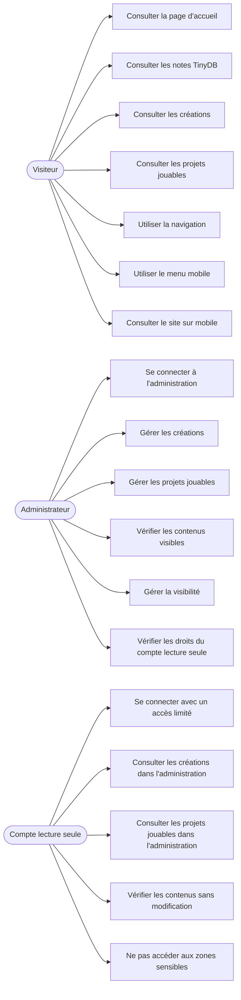

# Diagramme de cas d’utilisation — Frostia Games

## Objectif du document

Ce document présente les principaux cas d’utilisation du projet **Frostia Games**.

L’objectif est de montrer les interactions principales entre les utilisateurs et l’application dans la V1 du site.

La V1 reste volontairement simple.

Elle distingue trois types d’acteurs :

* le visiteur ;
* l’administrateur ;
* le compte de consultation en lecture seule.

Ce document permet de montrer que le projet possède :

* une partie publique ;
* une partie d’administration ;
* une consultation limitée possible ;
* un périmètre volontairement maîtrisé.

---

# 1. Acteurs

| Acteur | Rôle |
| ------ | ---- |
| Visiteur | Consulte les pages publiques du site. |
| Administrateur | Gère les contenus depuis l’administration Django. |
| Compte lecture seule | Consulte certains contenus dans l’administration sans les modifier. |

---

# 2. Cas d’utilisation du visiteur

Le visiteur peut consulter les différentes pages publiques du site.

| Cas d’utilisation | Description |
| ----------------- | ----------- |
| Consulter la page d’accueil | Le visiteur accède à la présentation générale du portfolio Frostia Games. |
| Consulter les notes de progression | Le visiteur peut voir les notes issues de TinyDB affichées sur l’accueil. |
| Consulter les créations | Le visiteur consulte les créations et projets présentés dans la page “Mes créations”. |
| Consulter les projets jouables | Le visiteur consulte les projets jouables ou démonstrations prévues. |
| Utiliser la navigation | Le visiteur utilise le menu pour passer d’une page à l’autre. |
| Utiliser le menu mobile | Le visiteur peut ouvrir et fermer le menu mobile. |
| Consulter le site sur mobile | Le visiteur peut utiliser le site depuis un écran réduit grâce au responsive. |

---

# 3. Cas d’utilisation de l’administrateur

L’administrateur utilise l’interface Django Admin pour gérer les contenus internes du site.

| Cas d’utilisation | Description |
| ----------------- | ----------- |
| Se connecter à l’administration | L’administrateur accède à l’interface `/admin/`. |
| Gérer les créations | L’administrateur peut ajouter, modifier ou masquer une création. |
| Gérer les projets jouables | L’administrateur peut ajouter, modifier ou masquer un projet jouable. |
| Vérifier les contenus visibles | L’administrateur peut contrôler les contenus affichés publiquement. |
| Gérer la visibilité | L’administrateur peut rendre un contenu visible ou invisible côté public. |
| Vérifier les droits | L’administrateur peut vérifier que le compte de consultation reste limité. |

---

# 4. Cas d’utilisation du compte lecture seule

Le compte de consultation en lecture seule permet un accès limité à l’administration Django.

Il sert à donner un droit de regard sans transmettre les pleins droits administrateur.

| Cas d’utilisation | Description |
| ----------------- | ----------- |
| Se connecter à l’administration | Le compte lecture seule peut accéder à `/admin/`. |
| Consulter les créations | Le compte peut voir les créations sans les modifier. |
| Consulter les projets jouables | Le compte peut voir les projets jouables sans les modifier. |
| Vérifier les contenus | Le compte peut vérifier les contenus présents dans l’administration. |
| Ne pas modifier les données | Le compte ne doit pas ajouter, modifier ou supprimer de contenu. |
| Ne pas accéder aux zones sensibles | Le compte ne doit pas accéder aux utilisateurs, groupes ou permissions sensibles. |

Les identifiants réels de ce compte ne doivent pas être écrits dans la documentation publique.

Ils peuvent être transmis séparément uniquement si cela est nécessaire.

---

# 5. Représentation Mermaid

---

# 6. Explication du diagramme

Le visiteur utilise principalement les pages publiques du site.

Il peut consulter :

* l’accueil ;
* les notes de progression affichées sur l’accueil ;
* les créations ;
* les projets jouables à venir.

Il peut également naviguer entre les pages depuis un ordinateur ou un appareil mobile.

L’administrateur intervient dans la partie privée du projet.

Il utilise l’administration Django pour :

* ajouter les contenus ;
* modifier les contenus ;
* masquer les contenus ;
* vérifier ce qui est visible publiquement ;
* contrôler les droits du compte de consultation.

Le compte lecture seule possède un rôle plus limité.

Il peut consulter certains contenus dans l’administration, mais il ne doit pas pouvoir modifier les données ni accéder aux zones sensibles.

Cette séparation permet de garder une V1 simple, tout en montrant une première logique de droits et de sécurité.

---

# 7. Fonctionnalités volontairement exclues de la V1

Le projet ne prévoit pas encore :

* de compte utilisateur public ;
* d’espace membre ;
* de système de téléchargement ;
* d’upload serveur réel ;
* de jeu jouable directement dans le navigateur ;
* d’API REST ;
* de système de rôles avancé ;
* d’interface d’administration personnalisée.

Ces fonctionnalités sont volontairement exclues de la V1 afin de conserver un périmètre maîtrisé.

---

# 8. Lien avec les preuves du dossier

Pour ce cas d’utilisation, les preuves utiles sont :

| Élément | Preuve possible |
| ------- | --------------- |
| Consultation publique | Capture de la page d’accueil |
| Créations visibles | Capture de la page “Mes créations” |
| Projets jouables | Capture de la page “Projets jouables” |
| Notes TinyDB | Capture de l’accueil avec les notes affichées |
| Menu mobile | Capture du menu mobile ouvert |
| Administration | Capture du tableau de bord Django |
| Compte lecture seule | Capture de l’administration avec accès limité |
| Absence de zones sensibles | Capture montrant l’accès réduit du compte lecture seule |

Aucune capture ne doit afficher de mot de passe, de clé secrète ou de donnée sensible.

---

# 9. Conclusion

Le diagramme de cas d’utilisation montre que la V1 de Frostia Games possède une structure simple mais cohérente.

Le visiteur consulte les pages publiques.

L’administrateur gère les contenus depuis l’administration Django.

Le compte lecture seule permet une consultation limitée sans donner les pleins droits administrateur.

Cette organisation correspond à l’objectif de la V1 : proposer un projet stable, clair, documenté et défendable, sans transformer le site en plateforme trop complexe.

