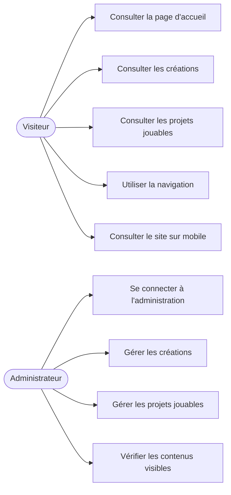

# Diagramme de cas d’utilisation — Frostia Games

## Objectif du document

Ce document présente les principaux cas d’utilisation du projet **Frostia Games**.

L’objectif est de montrer les interactions principales entre les utilisateurs et l’application dans la V1 du site.

La V1 reste volontairement simple. Elle distingue deux types d’acteurs :

* le visiteur ;
* l’administrateur.

---

## Acteurs

| Acteur         | Rôle                                              |
| -------------- | ------------------------------------------------- |
| Visiteur       | Consulte les pages publiques du site.             |
| Administrateur | Gère les contenus depuis l’administration Django. |

---

## Cas d’utilisation du visiteur

Le visiteur peut consulter les différentes pages publiques du site.

| Cas d’utilisation              | Description                                                                           |
| ------------------------------ | ------------------------------------------------------------------------------------- |
| Consulter la page d’accueil    | Le visiteur accède à la présentation générale du portfolio Frostia Games.             |
| Consulter les créations        | Le visiteur consulte les créations et projets présentés dans la page “Mes créations”. |
| Consulter les projets jouables | Le visiteur consulte les projets jouables ou démonstrations prévues.                  |
| Utiliser la navigation         | Le visiteur utilise le menu pour passer d’une page à l’autre.                         |
| Consulter le site sur mobile   | Le visiteur peut utiliser le site depuis un écran réduit grâce au responsive.         |

---

## Cas d’utilisation de l’administrateur

L’administrateur utilise l’interface Django Admin pour gérer les contenus internes du site.

| Cas d’utilisation               | Description                                                           |
| ------------------------------- | --------------------------------------------------------------------- |
| Se connecter à l’administration | L’administrateur accède à l’interface `/admin/`.                      |
| Gérer les créations             | L’administrateur peut ajouter, modifier ou masquer une création.      |
| Gérer les projets jouables      | L’administrateur peut ajouter, modifier ou masquer un projet jouable. |
| Vérifier les contenus visibles  | L’administrateur peut contrôler les contenus affichés publiquement.   |

---

## Représentation Mermaid

---

## Explication

Le visiteur utilise principalement les pages publiques du site. Il peut consulter l’accueil, les créations et les projets jouables. Il peut également naviguer entre les pages depuis un ordinateur ou un appareil mobile.

L’administrateur intervient dans la partie privée du projet. Il utilise l’administration Django pour gérer les contenus affichés sur le site. Cette séparation permet de garder une V1 simple, tout en disposant d’un espace de gestion interne.

Le projet ne prévoit pas encore de compte utilisateur public, d’espace membre ou de système de téléchargement. Ces fonctionnalités sont volontairement exclues de la V1 afin de conserver un périmètre maîtrisé.
