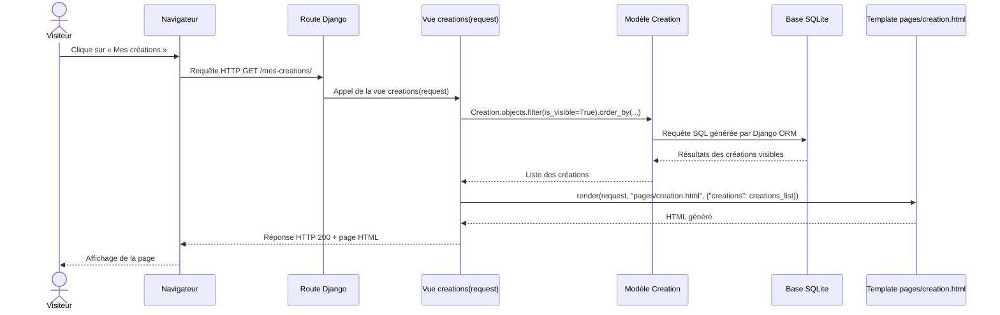

# Diagramme de séquence — Frostia Games

## Objectif du document

Ce document présente un **diagramme de séquence** pour le projet **Frostia Games**.

L’objectif est de montrer le déroulement d’un échange entre les différents éléments du projet lors de l’affichage d’une page dynamique.

Dans la V1, le site utilise Django pour :

* recevoir les requêtes HTTP ;
* faire correspondre une URL à une vue ;
* interroger les données utiles ;
* transmettre ces données à un template HTML ;
* générer une réponse affichée dans le navigateur.

---

## Scénario étudié

Le scénario retenu pour ce diagramme est le suivant :

**un visiteur consulte la page “Mes créations”.**

Ce scénario est pertinent car il met en relation plusieurs briques importantes du projet :

* l’utilisateur ;
* le navigateur ;
* le système de routage Django ;
* la vue Python ;
* le modèle Django ORM ;
* la base de données SQLite ;
* le template HTML.

Il permet donc de montrer concrètement le fonctionnement dynamique du back-end Django.

---

## Éléments impliqués

| Élément | Rôle |
| --- | --- |
| Visiteur | Demande l’affichage de la page. |
| Navigateur | Envoie la requête HTTP et affiche la réponse HTML. |
| Route Django | Associe l’URL demandée à la bonne vue. |
| Vue Django | Récupère les données et prépare la réponse. |
| Modèle `Creation` | Représente les créations stockées dans la base. |
| Base SQLite | Contient les données des créations. |
| Template `creation.html` | Génère le rendu HTML final. |

---

## Déroulement du scénario

Lorsqu’un visiteur consulte la page **Mes créations**, le déroulement est le suivant :

1. le visiteur clique sur le lien ou saisit l’URL de la page ;
2. le navigateur envoie une requête HTTP au serveur Django ;
3. Django analyse l’URL reçue ;
4. la route correspondante appelle la vue `creations` ;
5. la vue interroge le modèle `Creation` ;
6. Django ORM récupère les créations visibles dans la base SQLite ;
7. les données sont renvoyées à la vue ;
8. la vue transmet les données au template `pages/creation.html` ;
9. le template génère le HTML final ;
10. Django renvoie la réponse HTTP au navigateur ;
11. le navigateur affiche la page au visiteur.

---

## Représentation Mermaid



---

## Explication du diagramme

Ce diagramme montre que la page **Mes créations** n’est pas une simple page HTML statique.

Le navigateur envoie une requête au serveur Django. Django utilise d’abord son système de routage pour savoir quelle vue doit être exécutée. La vue `creations` récupère ensuite les données visibles du modèle `Creation`.

Le modèle ne manipule pas directement du SQL écrit à la main dans la vue. À la place, Django ORM construit la requête adaptée, interroge la base SQLite, puis renvoie les résultats à la vue.

Une fois les données récupérées, la vue les transmet au template `pages/creation.html`. Ce template transforme les données Python reçues en contenu HTML affichable dans le navigateur.

La réponse finale est ensuite renvoyée au visiteur.

---

## Fichiers concernés dans le projet

Ce scénario mobilise principalement les fichiers suivants :

```txt
core/views.py
core/urls.py
creations/models.py
templates/pages/creation.html
db.sqlite3
```

Rôle de chaque fichier :

| Fichier | Rôle |
| --- | --- |
| `core/urls.py` | Déclare la route de la page. |
| `core/views.py` | Contient la vue `creations`. |
| `creations/models.py` | Définit le modèle `Creation`. |
| `templates/pages/creation.html` | Affiche les créations dans la page HTML. |
| `db.sqlite3` | Stocke les données utilisées. |

---

## Exemple de logique associée

La logique générale de la vue repose sur une structure proche de celle-ci :

```python
creations_list = Creation.objects.filter(is_visible=True).order_by(
    "alphabet_letter",
    "title",
)

return render(
    request,
    "pages/creation.html",
    {
        "creations": creations_list,
    },
)
```

Ce code montre bien les trois étapes importantes :

1. récupération des données ;
2. préparation du contexte ;
3. rendu du template.

---

## Variante possible : page Projets jouables

Le même fonctionnement est appliqué pour la page **Projets jouables**.

La différence principale est que la vue utilise alors le modèle `PlayableProject` au lieu du modèle `Creation`.

Le principe reste identique :

* route URL ;
* vue Django ;
* modèle ;
* base de données ;
* template ;
* affichage dans le navigateur.

---

## Preuves à intégrer dans le dossier

Pour cette partie, les éléments de preuve à intégrer dans le dossier projet peuvent être les suivants :

| Élément | Preuve attendue |
| --- | --- |
| Route de la page | Capture du fichier `urls.py` |
| Vue Django | Capture du fichier `views.py` |
| Modèle interrogé | Capture du fichier `models.py` |
| Diagramme de séquence | Capture ou export du schéma Mermaid |
| Template HTML | Capture du fichier `creation.html` |
| Rendu final | Capture de la page “Mes créations” dans le navigateur |

---

## Intérêt pour le projet

Le diagramme de séquence permet de démontrer que le projet suit une logique back-end structurée.

Il met en évidence :

* le rôle du routage Django ;
* la place des vues dans le traitement des requêtes ;
* l’utilisation de Django ORM ;
* le lien entre la base de données et l’interface ;
* la transformation des données en rendu HTML.

Cette partie valorise directement la compréhension du fonctionnement interne de l’application.

---

## Conclusion

Le diagramme de séquence du projet **Frostia Games** montre comment une page dynamique est construite depuis la requête du visiteur jusqu’à l’affichage final dans le navigateur.

Il complète utilement les autres documents de conception, notamment :

* le diagramme de cas d’utilisation ;
* le MCD ;
* la documentation des modèles ;
* la documentation des vues et routes.

Il permet ainsi de mieux prouver la logique de développement utilisée dans la V1 du projet.
