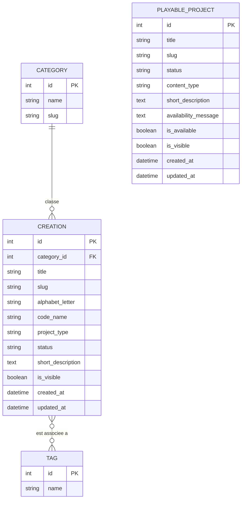
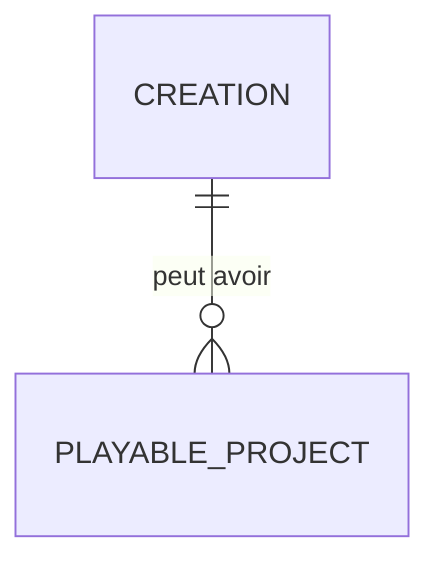

# MCD — Frostia Games

## Objectif du MCD

Ce document présente le **modèle conceptuel de données** du projet **Frostia Games**.

L’objectif est de représenter les principales données utilisées par la V1 du site.

Le projet repose principalement sur une base relationnelle **SQLite**, gérée avec **Django ORM**.

Dans cette version, quatre entités relationnelles sont utilisées :

* `Creation` : représente une création ou un projet présenté dans la page **Mes créations** ;
* `Category` : représente une catégorie permettant de classer les créations (relation 1,n avec `Creation`) ;
* `Tag` : représente une étiquette libre pouvant être associée à plusieurs créations (relation n,n avec `Creation`) ;
* `PlayableProject` : représente un projet jouable ou une démonstration prévue.

Le projet contient aussi une expérimentation NoSQL légère avec TinyDB pour les notes de progression. Cette partie est présentée séparément, car elle ne fait pas partie du modèle relationnel SQLite principal.

---

# 1. Vue d’ensemble du modèle

Le modèle relationnel repose sur quatre entités :

| Entité | Rôle |
| ------ | ---- |
| `Creation` | Stocker les créations ou projets présentés dans le portfolio. |
| `Category` | Classer chaque création dans une catégorie (ex : Jeu vidéo, Site web, Application mobile). |
| `Tag` | Ajouter des étiquettes libres et transverses à une création (ex : Solo, Prototype, Terminé). |
| `PlayableProject` | Stocker les futurs projets jouables ou démonstrations prévues. |

`Category` et `Tag` sont reliées à `Creation` par de vraies relations : une ForeignKey (1,n) pour `Category`, et une relation ManyToMany (n,n) pour `Tag`. `PlayableProject` reste une entité indépendante dans cette version.

---

# 2. Entité `Creation`

## Rôle

L’entité `Creation` permet de stocker les informations liées aux créations présentées sur le portfolio.

Elle alimente principalement la page :

```text
/mes-creations/
```

Elle permet de présenter un projet, une création, un prototype ou une idée liée à l’univers Frostia Games.

---

## Attributs

| Attribut | Type logique | Rôle |
| -------- | ------------ | ---- |
| `id` | entier | Identifiant unique de la création |
| `title` | texte court | Titre de la création |
| `slug` | texte court unique | Identifiant textuel utilisé pour les URLs ou références internes |
| `alphabet_letter` | texte court | Lettre utilisée pour le classement alphabétique |
| `code_name` | texte court | Nom de code du projet |
| `project_type` | texte court | Type de projet |
| `status` | texte court | État d’avancement du projet |
| `short_description` | texte long | Description courte du projet |
| `is_visible` | booléen | Indique si la création est visible publiquement |
| `created_at` | date / heure | Date de création de l’enregistrement |
| `updated_at` | date / heure | Date de dernière modification |

---

## Utilité dans la V1

Le champ `is_visible` permet de préparer une création dans l’administration Django sans forcément l’afficher immédiatement sur le site public.

Cela permet de séparer :

* les données préparées côté administration ;
* les données réellement visibles par le visiteur.

---

# 2 bis. Entités `Category` et `Tag`

## Rôle

L'entité `Category` permet de classer chaque création dans une catégorie unique (relation 1,n : une catégorie regroupe plusieurs créations, une création appartient à au plus une catégorie).

L'entité `Tag` permet d'associer librement des étiquettes transverses à une création (relation n,n : une création peut avoir plusieurs tags, un tag peut être utilisé par plusieurs créations).

## Attributs — `Category`

| Attribut | Type logique | Rôle |
| -------- | ------------ | ---- |
| `id` | entier | Identifiant unique de la catégorie |
| `name` | texte court unique | Nom affiché de la catégorie |
| `slug` | texte court unique | Identifiant textuel utilisé pour les URLs ou filtres |

## Attributs — `Tag`

| Attribut | Type logique | Rôle |
| -------- | ------------ | ---- |
| `id` | entier | Identifiant unique du tag |
| `name` | texte court unique | Nom affiché du tag |

## Table associative générée par Django

La relation n,n entre `Creation` et `Tag` est matérialisée en base par une table de jonction, générée automatiquement par Django ORM :

```text
creations_creation_tags (creation_id, tag_id)
```

C'est la traduction SQL classique d'une association Merise n,n : une table intermédiaire portant les deux clés étrangères, avec une contrainte d'unicité sur le couple `(creation_id, tag_id)`.

---

# 3. Entité `PlayableProject`

## Rôle

L’entité `PlayableProject` permet de stocker les informations liées aux projets jouables ou aux futures démonstrations.

Elle alimente principalement la page :

```text
/projets-jouables/
```

Dans la V1, aucun vrai jeu jouable dans le navigateur n’est encore intégré.

Cette entité sert à préparer la structure future sans annoncer une fonctionnalité qui n’est pas encore disponible.

---

## Attributs

| Attribut | Type logique | Rôle |
| -------- | ------------ | ---- |
| `id` | entier | Identifiant unique du projet jouable |
| `title` | texte court | Titre du projet jouable |
| `slug` | texte court unique | Identifiant textuel utilisé pour les URLs ou références internes |
| `status` | texte court | État du projet jouable |
| `content_type` | texte court | Type de contenu prévu |
| `short_description` | texte long | Description courte |
| `availability_message` | texte long | Message indiquant la disponibilité ou l’indisponibilité |
| `is_available` | booléen | Indique si le projet est réellement disponible |
| `is_visible` | booléen | Indique si le projet est visible publiquement |
| `created_at` | date / heure | Date de création de l’enregistrement |
| `updated_at` | date / heure | Date de dernière modification |

---

## Utilité dans la V1

Le modèle `PlayableProject` permet d’être honnête sur l’état des projets jouables.

Un projet peut être visible dans la page publique tout en indiquant clairement qu’aucune version jouable n’est encore disponible.

Le champ `is_available` permet de distinguer :

* un projet présenté comme prévu ;
* un projet réellement disponible ;
* une future démonstration.

---

# 4. Relations entre les entités

Le modèle contient désormais deux relations réelles :

| Relation | Type | Cardinalités | Description |
| -------- | ---- | ------------- | ------------ |
| `Category` — `Creation` | ForeignKey | 1,n (Category) — 0,1 (Creation) | Une catégorie regroupe plusieurs créations ; une création appartient à au plus une catégorie. |
| `Tag` — `Creation` | ManyToMany | n,n | Une création peut avoir plusieurs tags ; un tag peut être associé à plusieurs créations. |

`PlayableProject` reste indépendant des trois autres entités dans cette version.

## Relations futures possibles

Les futures évolutions pourront ajouter d'autres relations, par exemple :

* associer un projet jouable à une création ;
* ajouter des médias ;
* ajouter des versions de projet ;
* ajouter une page détaillée par création ;
* ajouter un journal de développement ;
* ajouter des notes de progression reliées aux projets.

Ces évolutions ne sont pas nécessaires pour cette version.

---

# 5. Représentation Mermaid



---

# 6. Lien avec Django ORM

Dans Django, les entités du MCD sont traduites en modèles Python.

Fichiers concernés :

```text
creations/models.py
playable/models.py
```

Correspondance :

| Entité du MCD | Modèle Django | Table SQL |
| ------------- | ------------- | --------- |
| `Creation` | `Creation` | `creations_creation` |
| `Category` | `Category` | `creations_category` |
| `Tag` | `Tag` | `creations_tag` |
| Relation `Creation` ↔ `Tag` | `ManyToManyField` | `creations_creation_tags` (table associative) |
| `PlayableProject` | `PlayableProject` | `playable_playableproject` |

Pour la correspondance détaillée entre requêtes ORM et SQL généré (jointures 1,n et n,n, agrégation), voir le document dédié :

```text
Docs/sql/orm-vers-sql.md
```

Django ORM permet de manipuler ces données avec du code Python.

Exemple :

```python
Creation.objects.filter(is_visible=True)
```

Cet exemple récupère uniquement les créations visibles côté public.

---

# 7. Lien avec SQL

Les modèles Django génèrent des tables SQL grâce aux migrations.

Fichiers SQL documentaires :

```text
docs/sql/create_tables_creations.sql
docs/sql/create_tables_playable.sql
docs/sql/exemples_insert.sql
docs/sql/sql-natif.md
```

Ces fichiers permettent de montrer la correspondance entre :

* le modèle conceptuel ;
* les modèles Django ;
* les migrations ;
* les tables SQL ;
* les exemples d’insertion.

Le SQL natif reste documentaire.

Dans le fonctionnement réel du projet, les tables sont créées et mises à jour par les migrations Django.

---

# 8. Partie NoSQL hors MCD relationnel

Le projet contient aussi une expérimentation NoSQL légère avec TinyDB.

Cette partie ne fait pas partie du MCD relationnel principal, car elle repose sur un fichier JSON.

Fichiers concernés :

```text
Docs/nosql/project_notes.json
Docs/nosql/read_project_notes.py
Docs/nosql/structure-nosql.md
Docs/nosql/tinydb-integration.md
```

TinyDB sert à stocker des notes de progression sous forme de documents JSON.

Exemple logique d’un document NoSQL :

```json
{
  "project_code": "frostia-games",
  "title": "Renforcement du dossier projet",
  "content": "Ajout des documents de conception, SQL et NoSQL.",
  "status": "in_progress",
  "tags": ["dossier", "conception", "sql", "nosql"]
}
```

Cette structure est volontairement séparée du modèle relationnel principal.

SQLite reste la base principale de la V1.

TinyDB sert uniquement de preuve NoSQL légère.

---

# 9. Justification des choix

La base relationnelle SQLite est utilisée pour stocker les données principales du site, car les informations sont structurées et stables.

Django ORM permet de manipuler ces données à partir des modèles Python, tout en générant les migrations nécessaires à la création des tables.

Le choix de séparer `Creation` et `PlayableProject` permet de garder une organisation claire :

* les créations servent à présenter l’univers et les projets du portfolio ;
* les projets jouables servent à présenter les démonstrations ou versions jouables prévues.

Cette séparation rend la V1 plus simple à maintenir.

Elle laisse aussi la possibilité d’ajouter des relations plus tard si le projet évolue.

---

# 10. Limites du MCD actuel

Le MCD contient désormais deux relations réelles (`Category` en 1,n et `Tag` en n,n sur `Creation`). Il ne contient pas encore :

* table de médias ;
* table de versions ;
* table de journal de développement ;
* table de commentaires ;
* table de statistiques ;
* table de fichiers uploadés ;
* relation entre `Creation` et `PlayableProject`.

Ces éléments sont reportés afin de conserver une structure stable.

---

# 11. Évolutions possibles du MCD

Une future version pourrait ajouter de nouvelles entités :

```text
ProjectDetail
ProjectVersion
MediaAsset
DevelopmentLog
ProjectTag
ProjectLink
```

Une relation possible pourrait être ajoutée entre `Creation` et `PlayableProject`.

Exemple futur :



Cette évolution permettrait d’associer un ou plusieurs projets jouables à une création principale.

Elle n’est pas intégrée maintenant afin de ne pas complexifier inutilement la V1.

---

# 12. Preuves à intégrer dans le dossier

Pour cette partie, les preuves utiles sont :

| Élément | Preuve possible |
| ------- | --------------- |
| MCD Mermaid | Capture ou export du diagramme |
| Modèle `Creation` | Capture de `creations/models.py` |
| Modèle `PlayableProject` | Capture de `playable/models.py` |
| Table SQL `Creation` | Capture de `docs/sql/create_tables_creations.sql` |
| Table SQL `PlayableProject` | Capture de `docs/sql/create_tables_playable.sql` |
| Exemples SQL | Capture de `docs/sql/exemples_insert.sql` |
| Administration Django | Capture des modèles visibles dans `/admin/` |
| Rendu final | Capture des pages utilisant les données |

---

# 13. Conclusion

Le MCD de Frostia Games repose sur quatre entités relationnelles :

* `Creation` ;
* `Category`, reliée à `Creation` par une relation 1,n ;
* `Tag`, relié à `Creation` par une relation n,n (via une table associative) ;
* `PlayableProject`, indépendante.

Ces relations permettent de démontrer une vraie modélisation Merise (cardinalités 1,n et n,n) et sont directement exploitées par l'ORM Django, avec un exemple détaillé de traduction ORM → SQL dans `Docs/sql/orm-vers-sql.md`.

TinyDB est traité séparément comme une expérimentation NoSQL légère.

Cette organisation permet de garder un projet stable, lisible et évolutif, tout en montrant une vraie réflexion sur les données utilisées par l'application.