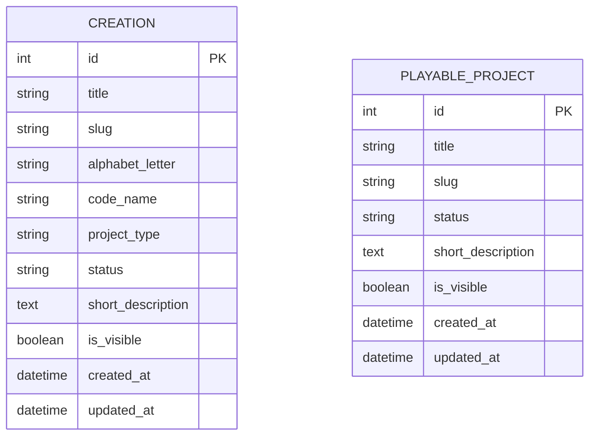

# MCD — Frostia Games

## Objectif du MCD

Ce document présente le modèle conceptuel de données du projet **Frostia Games**.

L’objectif est de représenter les principales données utilisées par la V1 du site.
Le projet repose sur une base relationnelle SQLite gérée avec Django ORM.

Dans cette V1, deux entités principales sont utilisées :

* `Creation` : représente une création ou un projet présenté dans la page “Mes créations”.
* `PlayableProject` : représente un projet jouable ou une démonstration prévue.

---

## Entité : Creation

L’entité `Creation` permet de stocker les informations liées aux créations présentées sur le portfolio.

| Attribut          | Rôle                                            |
| ----------------- | ----------------------------------------------- |
| id                | Identifiant unique de la création               |
| title             | Titre de la création                            |
| slug              | Identifiant textuel utilisé pour l’URL          |
| alphabet_letter   | Lettre utilisée pour le classement alphabétique |
| code_name         | Nom de code du projet                           |
| project_type      | Type de projet                                  |
| status            | État d’avancement du projet                     |
| short_description | Description courte du projet                    |
| is_visible        | Indique si la création est visible publiquement |
| created_at        | Date de création de l’enregistrement            |
| updated_at        | Date de dernière modification                   |

---

## Entité : PlayableProject

L’entité `PlayableProject` permet de stocker les informations liées aux projets jouables ou aux futures démonstrations.

| Attribut          | Rôle                                          |
| ----------------- | --------------------------------------------- |
| id                | Identifiant unique du projet jouable          |
| title             | Titre du projet jouable                       |
| slug              | Identifiant textuel utilisé pour l’URL        |
| status            | État du projet jouable                        |
| short_description | Description courte                            |
| is_visible        | Indique si le projet est visible publiquement |
| created_at        | Date de création de l’enregistrement          |
| updated_at        | Date de dernière modification                 |

---

## Relations

Dans la V1 actuelle, les entités `Creation` et `PlayableProject` sont indépendantes.

Il n’existe pas encore de relation directe entre elles, car le projet reste volontairement limité afin de garder une structure simple, stable et compréhensible.

Les futures évolutions pourront ajouter des relations, par exemple :

* associer un projet jouable à une création ;
* ajouter des catégories ;
* ajouter des tags ;
* ajouter des notes de progression ;
* ajouter une page détaillée par création.

---

## Représentation Mermaid

---

## Justification des choix

La base relationnelle SQLite est utilisée pour stocker les données principales du site, car les informations sont structurées et stables.

Django ORM permet de manipuler ces données à partir des modèles Python, tout en générant les migrations nécessaires à la création des tables.

Le choix de séparer les créations et les projets jouables permet de garder une organisation claire :

* les créations servent à présenter l’univers et les projets du portfolio ;
* les projets jouables servent à présenter les démonstrations ou versions jouables prévues.

Cette séparation rend la V1 plus simple à maintenir et laisse la possibilité d’ajouter des relations plus tard si le projet évolue.
